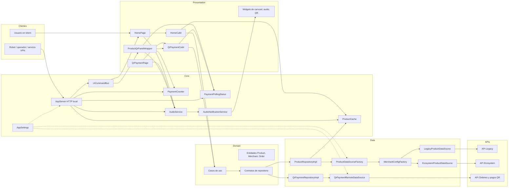
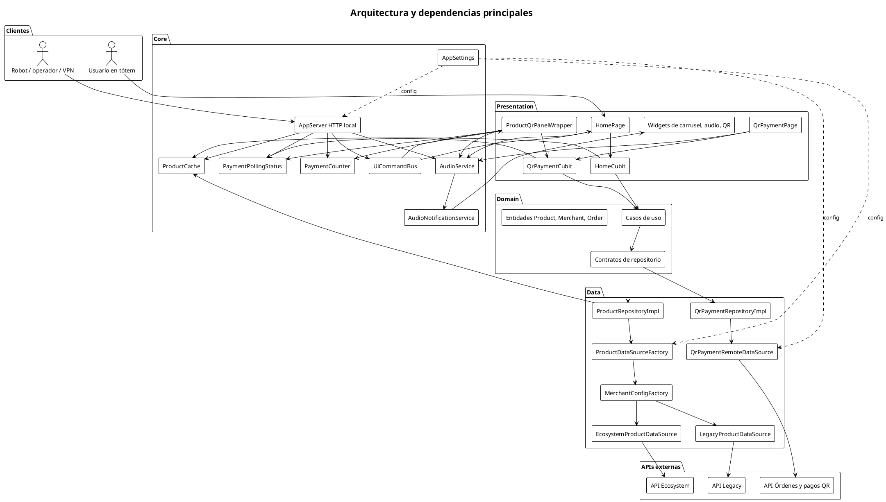

# Diagrama de arquitectura y dependencias principales

Muestra cómo se relacionan las capas internas (Presentation, Domain, Data), los servicios compartidos (Core), las APIs externas y el servidor HTTP local con sus consumidores.

## Mermaid

## PlantUML

## Cuándo actualizar

- Cuando se agregue o elimine una capa, un servicio compartido o una API externa.
- Cuando cambie la forma en que `AppServer` publica comandos.
- Cuando se incorpore un nuevo consumidor remoto (por ejemplo, un nuevo tipo de robot).
- Cuando cambie la relación entre `ProductRepositoryImpl`, `ProductDataSourceFactory` y `MerchantConfigFactory`.
