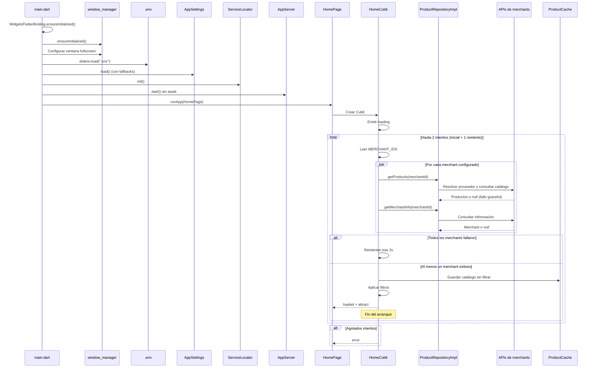
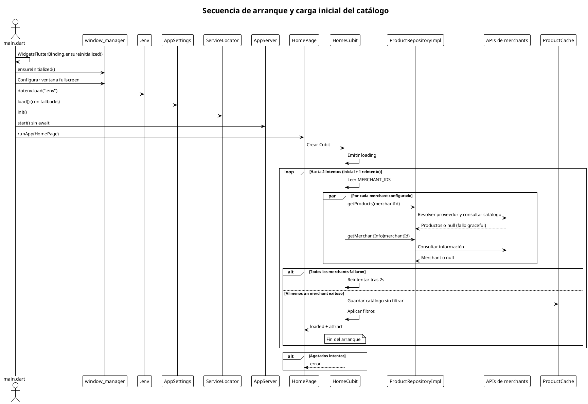

# Secuencia de arranque y carga inicial del catálogo

Ilustra el orden de inicialización desde `main.dart` hasta que la interfaz muestra el catálogo filtrado, incluyendo reintentos y fallos parciales.

## Mermaid

## PlantUML

## Cuándo actualizar

- Cuando cambie el orden de arranque en `main.dart`.
- Cuando se agregue una nueva fuente de configuración o persistencia real en disco.
- Cuando el paralelismo de carga de merchants cambie de comportamiento.
- Cuando cambie la política de reintentos o fallos parciales.
