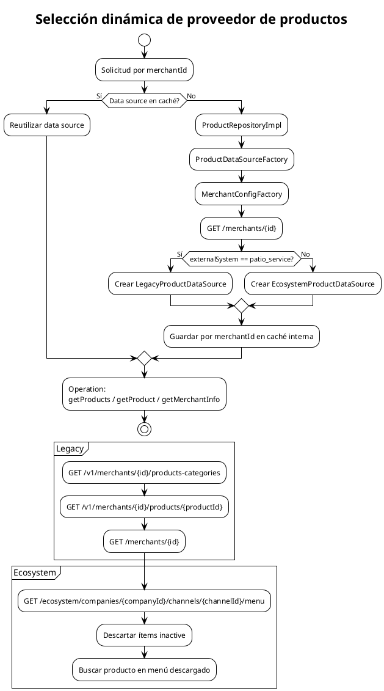

# Selección dinámica de proveedor de productos

Describe cómo `ProductRepositoryImpl` decide entre `LegacyProductDataSource` y `EcosystemProductDataSource` para cada merchant, con `ProductDataSourceFactory` y `MerchantConfigFactory`.

## Mermaid

```mermaid
flowchart TD
    Start[Solicitud por merchantId] --> Cached{Data source en caché?}
    Cached -- Sí --> Use[Reutilizar data source]
    Cached -- No --> Repo[ProductRepositoryImpl]
    Repo --> Factory[ProductDataSourceFactory]
    Factory --> MerchantFactory[MerchantConfigFactory]
    MerchantFactory --> Config[GET /merchants/{id}]
    Config --> System{externalSystem == patio_service?}
    System -- Sí --> Legacy[Crear LegacyProductDataSource]
    System -- No --> Ecosystem[Crear EcosystemProductDataSource]
    Legacy --> Store[Guardar por merchantId en caché interna]
    Ecosystem --> Store
    Store --> Use
    Use --> Operation[getProducts / getProduct / getMerchantInfo]

    subgraph LegacyAPI
        L1[GET /v1/merchants/{id}/products-categories]
        L2[GET /v1/merchants/{id}/products/{productId}]
        L3[GET /merchants/{id}]
    end

    subgraph EcosystemAPI
        E1[GET /ecosystem/companies/{companyId}/channels/{channelId}/menu]
        E2[Descartar ítems inactive]
        E3[Buscar producto en menú descargado]
    end

    Legacy --> LegacyAPI
    Ecosystem --> EcosystemAPI
```

## PlantUML



## Cuándo actualizar

- Cuando se agregue un tercer proveedor de catálogos.
- Cuando cambie la lógica de detección (por ejemplo, ya no se use `patio_service`).
- Cuando se modifique la estrategia de cacheo de data sources.
- Cuando cambien las rutas de Ecosystem o Legacy.
