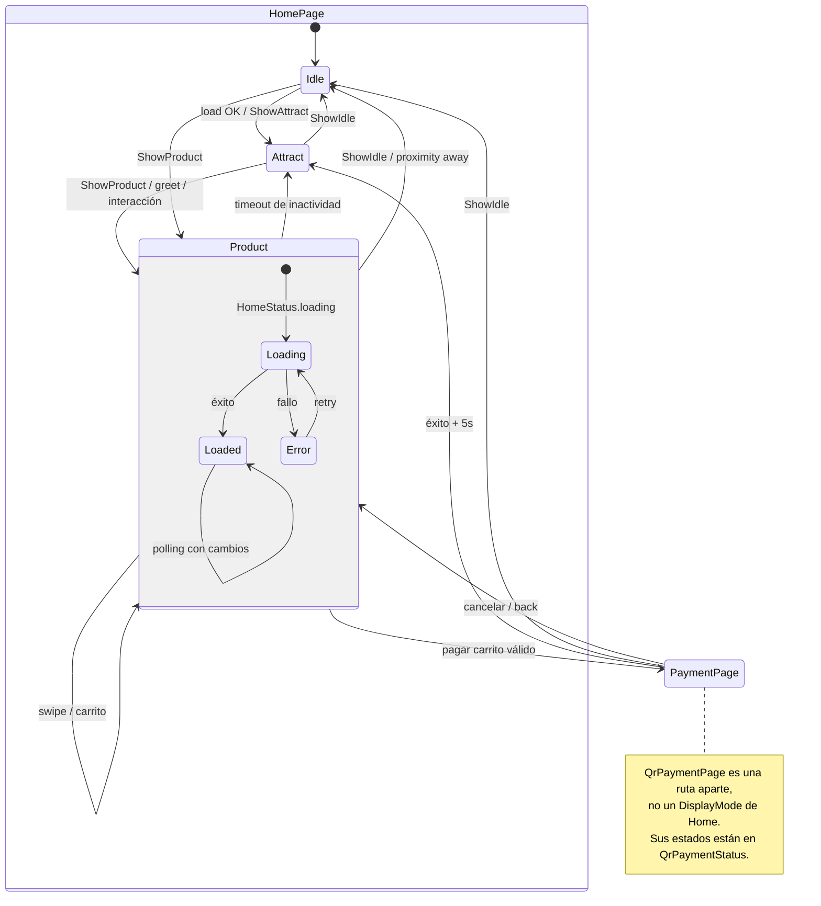
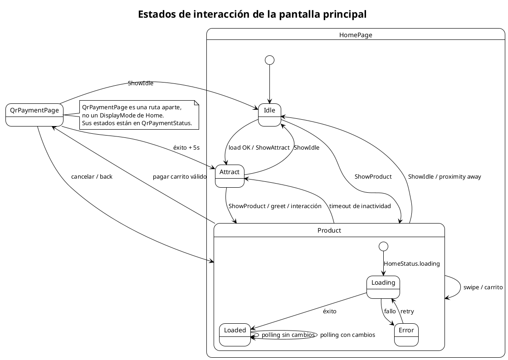

# Estados de interacción de la pantalla principal

Muestra los dos modelos de estado involucrados en `HomePage`: los modos visuales (`DisplayMode`) y los estados de datos (`HomeStatus`). El pago se realiza en una ruta separada (`QrPaymentPage`), no es un modo visual de Home.

## Mermaid

## PlantUML

## Cuándo actualizar

- Cuando se agregue un nuevo modo visual (`DisplayMode`).
- Cuando cambie la navegación entre pantallas o el timeout de inactividad.
- Cuando se incorpore un nuevo comando remoto que afecte la pantalla principal.
