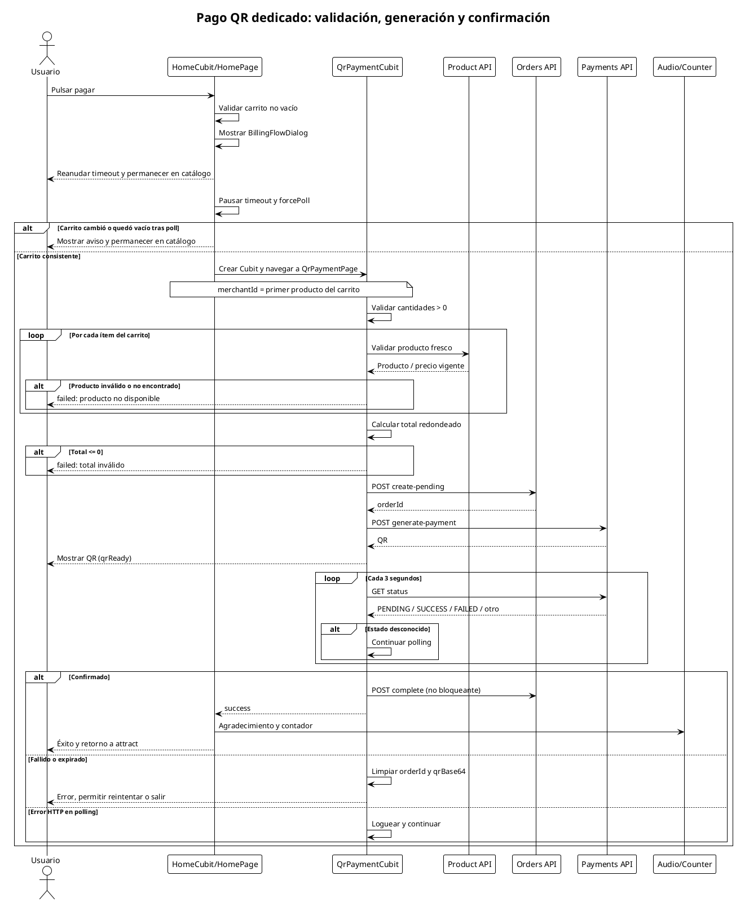

# Pago QR dedicado: validación, generación y confirmación

Secuencia completa desde que el usuario pulsa pagar hasta la confirmación o fallo. Incluye validación de carrito, polling, estados de error y la nota sobre multi-merchant.

## Mermaid

```mermaid
sequenceDiagram
    actor User as Usuario
    participant Home as HomeCubit/HomePage
    participant Pay as QrPaymentCubit
    participant Product as Product API
    participant Orders as Orders API
    participant Payments as Payments API
    participant Audio as Audio/Counter

    User->>Home: Pulsar pagar
    Home->>Home: Validar carrito no vacío
    Home->>Home: Mostrar BillingFlowDialog
    alt Usuario cancela o cierra diálogo
        Home-->>User: Reanudar timeout y permanecer en catálogo
    else Usuario continúa (con o sin factura)
        Home->>Home: Pausar timeout y forcePoll
        alt Carrito cambió o quedó vacío tras poll
            Home-->>User: Mostrar aviso y permanecer en catálogo
        else Carrito consistente
        Home->>Pay: Crear Cubit y navegar a QrPaymentPage
        Note over Home,Pay: merchantId = primer producto del carrito
        
        Pay->>Pay: Validar cantidades > 0
        loop Por cada ítem del carrito
            Pay->>Product: Validar producto fresco
            Product-->>Pay: Producto / precio vigente
            alt Producto inválido o no encontrado
                Pay-->>User: failed: producto no disponible
            end
        end

        Pay->>Pay: Calcular total redondeado
        alt Total <= 0
            Pay-->>User: failed: total inválido
        end

        Pay->>Orders: POST create-pending
        Orders-->>Pay: orderId
        Pay->>Payments: POST generate-payment
        Payments-->>Pay: QR
        Pay-->>User: Mostrar QR (qrReady)

        loop Cada 3 segundos
            Pay->>Payments: GET status
            Payments-->>Pay: PENDING / SUCCESS / FAILED / otro
            alt Estado desconocido
                Pay->>Pay: Continuar polling
            end
        end

        alt Confirmado
            Pay->>Orders: POST complete (no bloqueante)
            Pay-->>Home: success
            Home->>Audio: Agradecimiento y contador
            Home-->>User: Éxito y retorno a attract
        else Fallido o expirado
            Pay->>Pay: Limpiar orderId y qrBase64
            Pay-->>User: Error, permitir reintentar o salir
        else Error HTTP en polling
            Pay->>Pay: Loguear y continuar
        end
    end
```

## PlantUML



## Notas importantes

- El `merchantId` usado para validar productos y crear la orden proviene del **primer producto del carrito**. Esto puede ser una limitación para carritos multi-merchant.
- El QR no expira por un timer local; la expiración depende del estado devuelto por el backend.
- `cancel()` detiene el polling y emite `cancelled`, excepto si el estado ya es `success`.
- `stopPollingOnly()` detiene el timer sin cambiar el estado, usado al cerrar la ruta.

## Cuándo actualizar

- Cuando cambie la frecuencia de polling o se agregue un nuevo estado de pago.
- Cuando se modifique la validación previa al pago.
- Cuando cambie la forma de agrupar el carrito en la orden.
- Cuando se resuelva la limitación multi-merchant.
