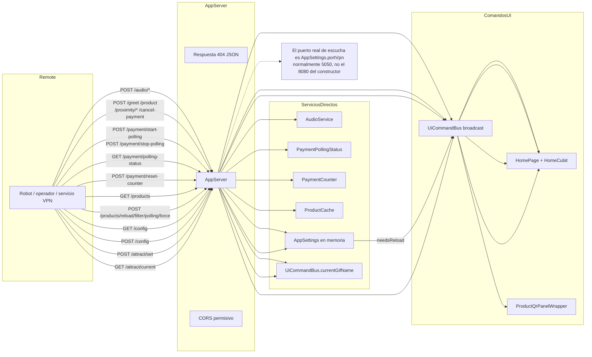
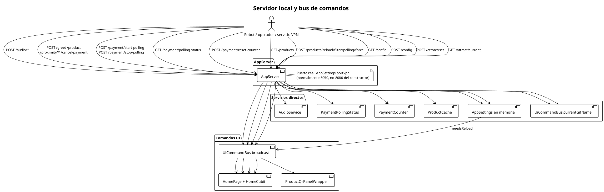

# Servidor local y bus de comandos

Muestra cómo los consumidores externos interactúan con `AppServer`, qué endpoints publican comandos en `UiCommandBus`, cuáles actúan directamente sobre servicios singleton, y cuál es el puerto real de escucha.

## Mermaid

## PlantUML

## Cuándo actualizar

- Cuando se agregue o elimine un endpoint del servidor local.
- Cuando cambie la forma en que los comandos se publican o consumen.
- Cuando se incorpore un nuevo servicio singleton expuesto por HTTP.
- Cuando se unifique el puerto del constructor con el puerto real de bind.
