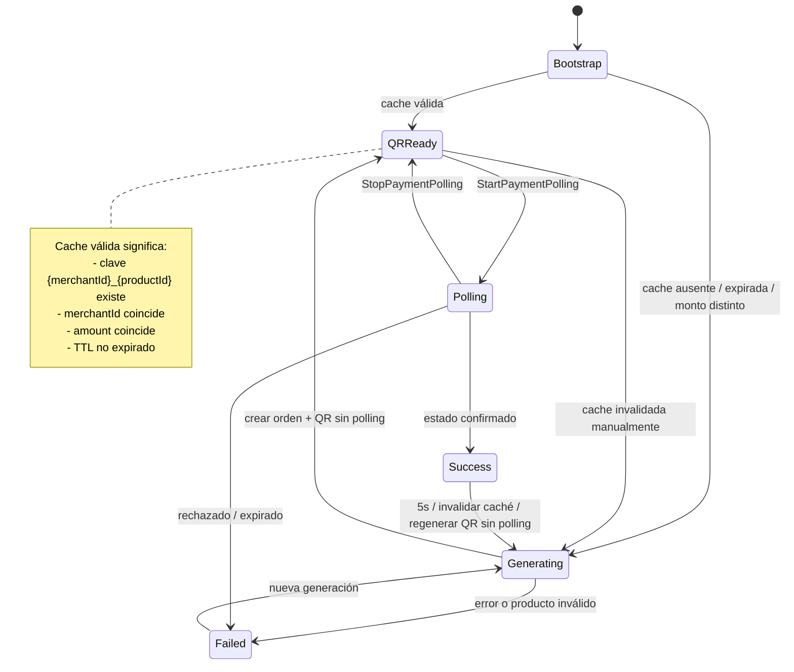
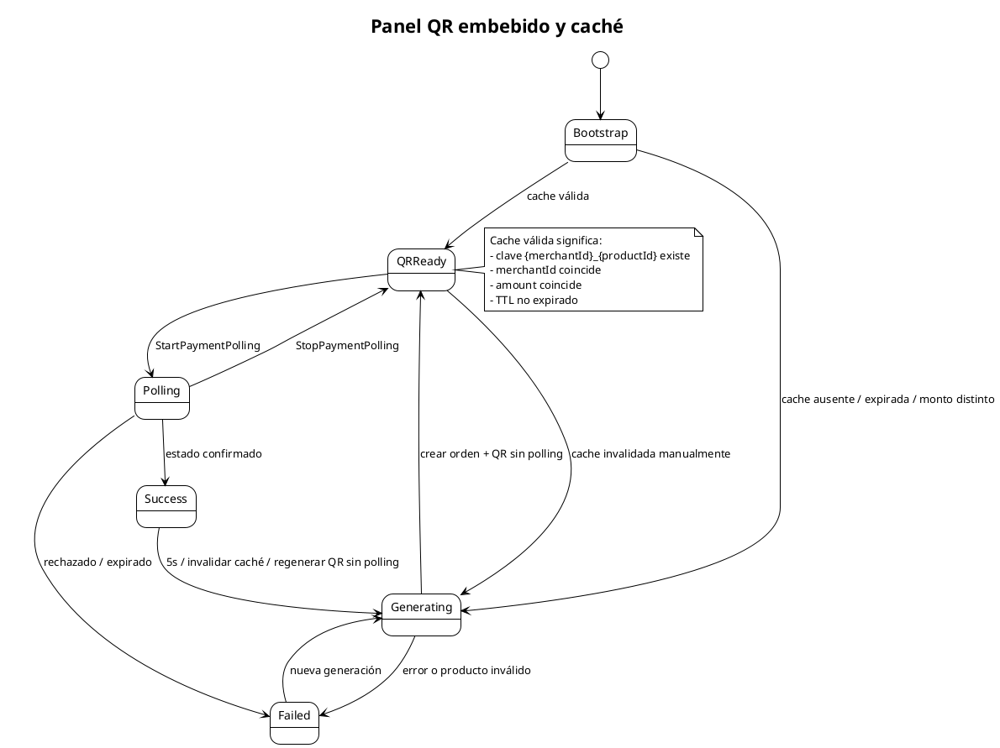

# Panel QR embebido y caché

Estados del flujo de QR embebido (`ProductQrPanelWrapper`). Este flujo está implementado pero utiliza polling manual por operador. Actualmente no es el flujo principal conectado desde `HomePage`, que usa `QrPaymentPage` con polling automático.

## Mermaid

## PlantUML

## Notas importantes

- La caché es estática y compartida entre instancias del wrapper.
- La clave de caché es `{merchantId}_{productId}`.
- `StopPaymentPolling` detiene el timer pero **conserva** QR y orden, volviendo a `QRReady`.
- El éxito dura cinco segundos, luego se invalida la caché y se genera un QR nuevo sin polling.
- `PaymentPollingStatus` publica las fases `waiting`, `polling`, `success` y `failed` para consultas HTTP.

## Cuándo actualizar

- Cuando cambie la clave de caché o el TTL del QR embebido.
- Cuando se agregue un nuevo estado al panel.
- Cuando cambie el comportamiento post-éxito.
- Cuando el panel se conecte o desconecte del flujo principal.
