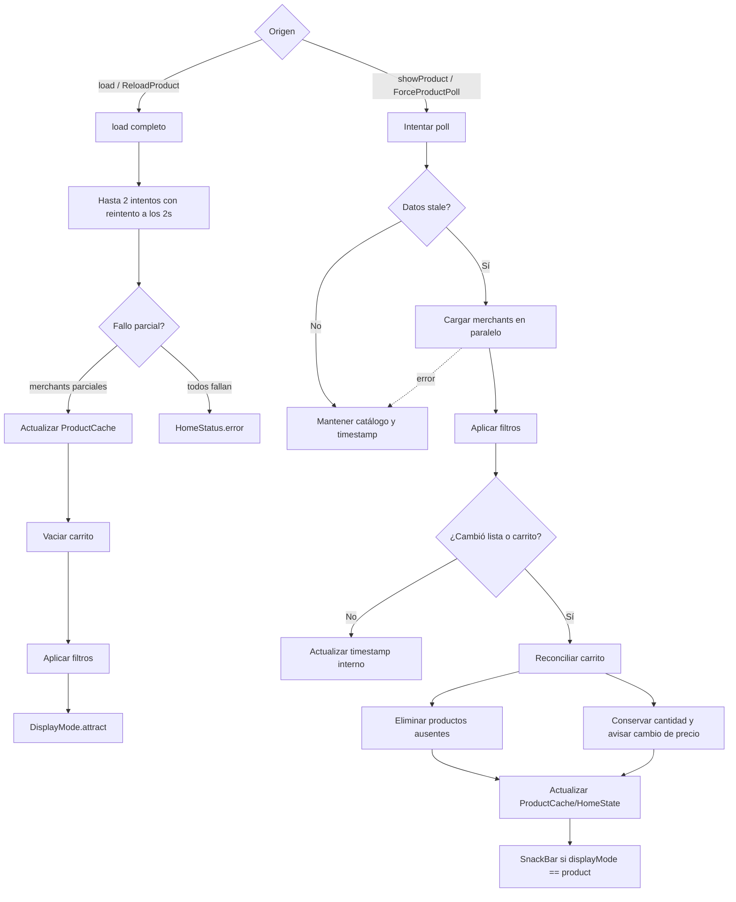
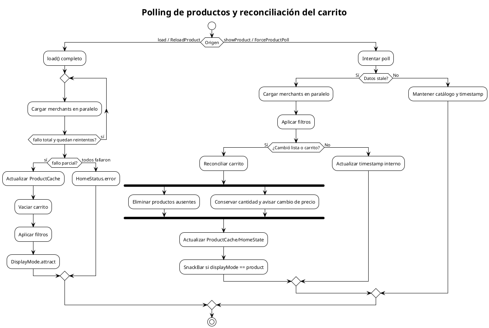

# Polling de productos y reconciliación del carrito

Flujo de decisión cuando se solicita mostrar el catálogo o se fuerza un polling de productos, incluyendo reconciliación del carrito y diferencias entre `load()` y `_pollProducts()`.

## Mermaid

## PlantUML

## Diferencia clave entre `load()` y `_pollProducts()`

| Aspecto | `load()` | `_pollProducts()` |
|---|---|---|
| Reinicio de carrito | Sí, vacía el carrito | No, reconcilia conservando cantidades |
| Modo visual final | `attract` | Conserva el actual |
| Reintentos | Sí, hasta 2 intentos | Sí, usa `_loadWithRetry()` |
| Error | Emite `HomeStatus.error` | Fallo silencioso, conserva estado anterior |
| SnackBar | No | Sí, si hay cambios y está en modo `product` |
| Timestamp | Actualiza `_lastPollTimestamp` | Actualiza `_lastPollTimestamp` |

## Cuándo actualizar

- Cuando cambie el umbral de staleness (`PRODUCT_POLLING_STALE_SECONDS`).
- Cuando se modifique la lógica de reconciliación.
- Cuando se agregue un nuevo paso al flujo de refresco del catálogo.
- Cuando cambie la política de reintentos.
