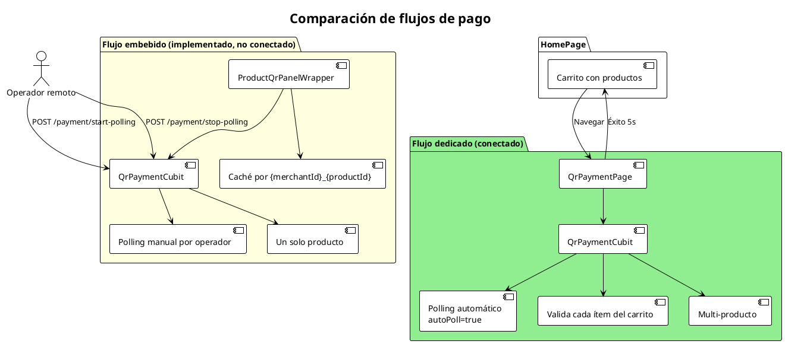

# Comparación de flujos de pago

Existen dos implementaciones de pago QR en el proyecto. Esta comparación muestra sus diferencias y qué camino está conectado actualmente desde `HomePage`.

## Mermaid

```mermaid
flowchart TD
    subgraph Home["HomePage"]
        Cart[Carrito con productos]
    end

    subgraph Dedicado["Flujo dedicado (conectado)"]
        D1[QrPaymentPage]
        D2[QrPaymentCubit]
        D3[Polling automático autoPoll=true]
        D4[Valida cada ítem del carrito]
        D5[Multi-producto]
    end

    subgraph Embebido["Flujo embebido (implementado, no conectado a HomePage)"]
        E1[ProductQrPanelWrapper]
        E2[QrPaymentCubit]
        E3[Polling manual por operador]
        E4[Un solo producto]
        E5[Caché por {merchantId}_{productId}]
    end

    Cart -->|Navegar| D1
    D1 --> D2
    D2 --> D3
    D2 --> D4
    D2 --> D5
    D1 -->|Éxito 5s| Home

    E1 --> E2
    E2 --> E3
    E2 --> E4
    E1 --> E5

    Remote[Operador remoto] -->|POST /payment/start-polling| E2
    Remote -->|POST /payment/stop-polling| E2
```

## PlantUML



## Diferencias clave

| Aspecto | Flujo dedicado | Flujo embebido |
|---|---|---|
| Pantalla | `QrPaymentPage` | `ProductQrPanelWrapper` |
| Inicio desde | `HomePage` al pulsar pagar | No conectado actualmente |
| Polling | Automático | Manual por operador remoto |
| Productos | Multi-producto | Un solo producto |
| Caché de QR | No | Sí, por `{merchantId}_{productId}` |
| Entrada remota | `/cancel-payment` | `/payment/start-polling`, `/payment/stop-polling` |
| Retorno al éxito | A `DisplayMode.attract` | Regenera QR fresco dentro del panel |

## Cuándo actualizar

- Cuando se conecte o desconecte el panel embebido del flujo principal.
- Cuando cambie el comportamiento de polling de cualquiera de los dos flujos.
- Cuando se unifiquen o separen más las dos implementaciones.
