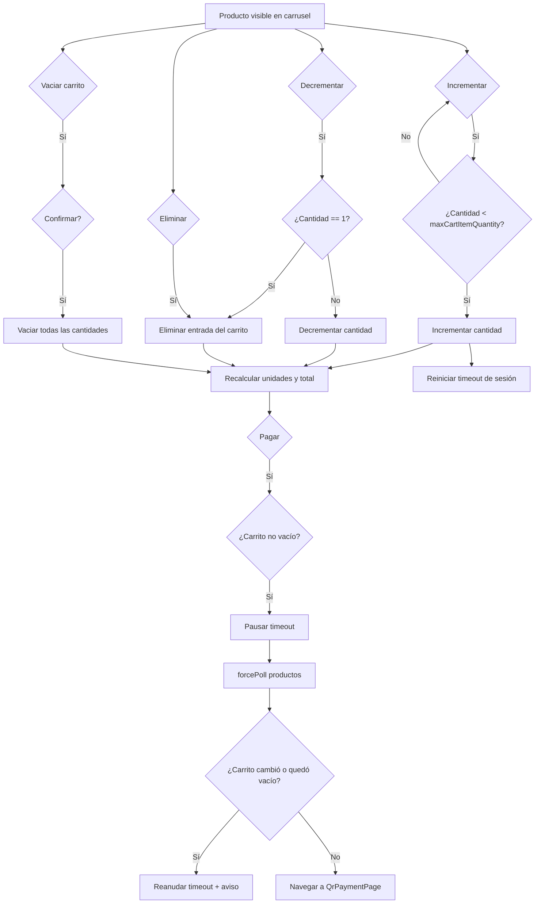
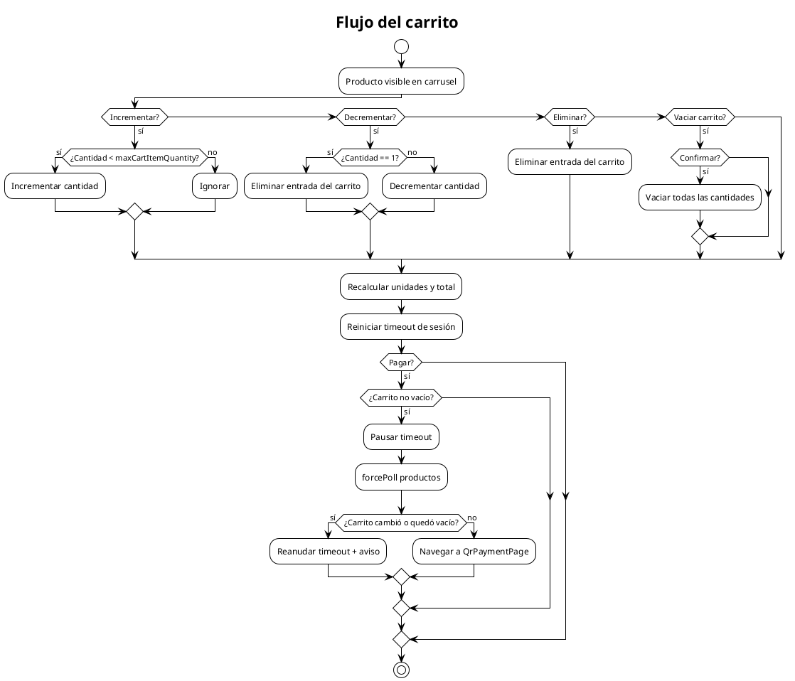

# Flujo del carrito

Describe cómo el usuario gestiona cantidades, límites, vaciado y preparación del carrito antes del pago.

## Mermaid

## PlantUML

## Detalles de implementación

- Las cantidades se almacenan con clave `merchantId_productId`.
- `maxCartItemQuantity` viene de `AppSettings`.
- El carrito se vacía al entrar en `DisplayMode.attract` o `DisplayMode.idle`.
- `load()` reinicia el carrito; `_pollProducts()` lo reconcilia.

## Cuándo actualizar

- Cuando cambie la clave del carrito o el límite máximo.
- Cuando se agregue confirmación en otras operaciones.
- Cuando cambie la preparación previa al pago.
