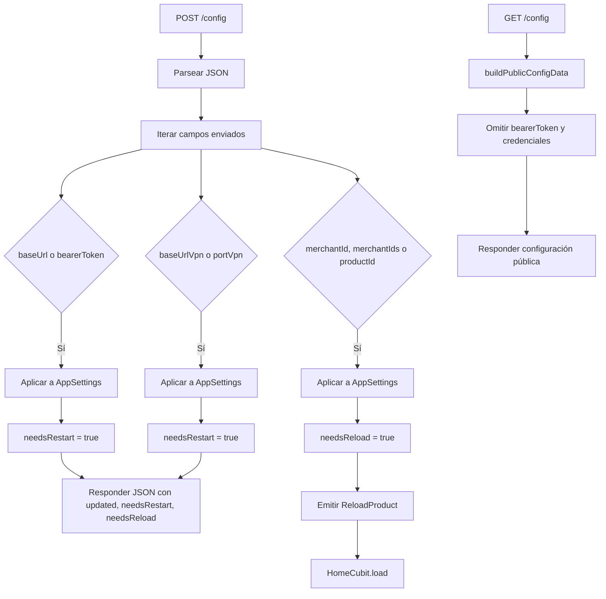
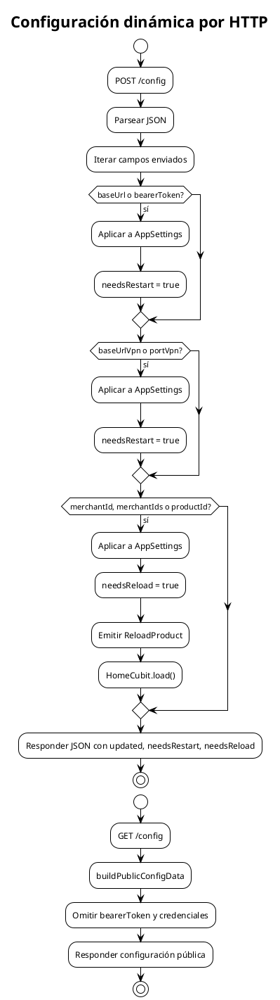

# Configuración dinámica por HTTP

Muestra cómo `POST /config` modifica `AppSettings` en memoria y qué campos requieren reinicio, recarga o simplemente quedan aplicados.

## Mermaid

## PlantUML

## Limitaciones importantes

- Los cambios **no se persisten en disco**.
- `ConfigStorage` existe pero no participa actualmente en `AppSettings.load()` ni en `POST /config`.
- Cambiar `baseUrl`, `bearerToken`, `baseUrlVpn` o `portVpn` requiere reiniciar la app porque los clientes Dio y el socket ya fueron creados.
- Cambiar `merchantId`, `merchantIds` o `productId` dispara `ReloadProduct`.

## Cuándo actualizar

- Cuando se implemente persistencia real de configuración.
- Cuando se permita modificar más campos en runtime.
- Cuando se reconstruyan clientes Dio sin reinicio.
