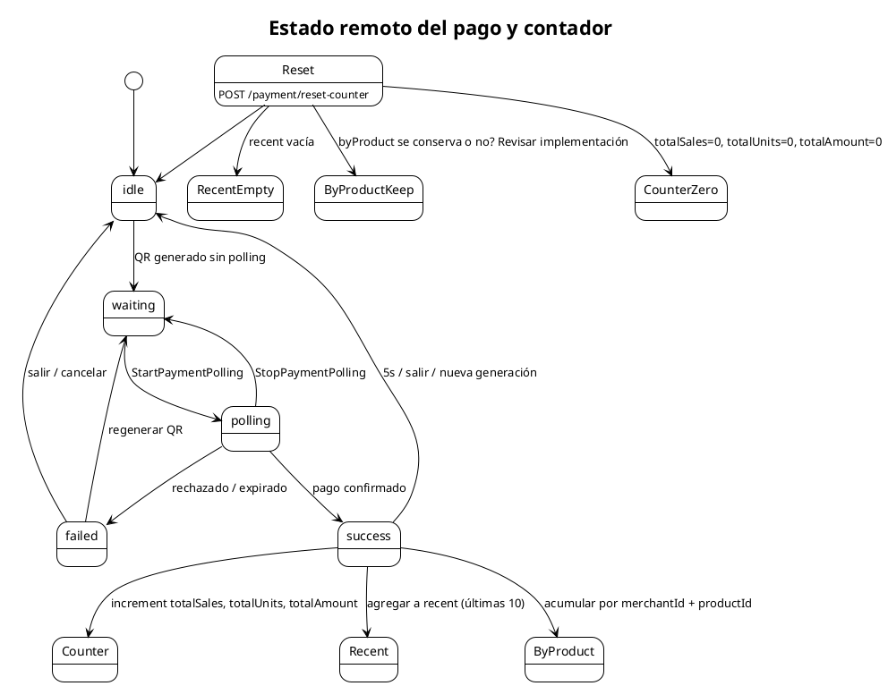

# Estado remoto del pago y contador

Describe cómo `PaymentPollingStatus` y `PaymentCounter` exponen el estado del pago visible a través de `GET /payment/polling-status`, y cómo se reinicia el contador.

## Mermaid

```mermaid
stateDiagram-v2
    [*] --> idle
    idle --> waiting: QR generado sin polling
    waiting --> polling: StartPaymentPolling
    polling --> success: pago confirmado
    polling --> failed: rechazado / expirado
    success --> idle: 5s / salir / nueva generación
    failed --> waiting: regenerar QR
    failed --> idle: salir / cancelar
    polling --> waiting: StopPaymentPolling

    success --> Counter: increment totalSales, totalUnits, totalAmount
    success --> Recent: agregar a recent (últimas 10)
    success --> ByProduct: acumular por merchantId + productId

    Reset[POST /payment/reset-counter] --> idle
    Reset --> CounterZero[totalSales=0, totalUnits=0, totalAmount=0]
    Reset --> RecentEmpty[recent vacía]
    Reset --> ByProductKeep[byProduct se conserva o no? Revisar implementación]
```

## PlantUML



## Detalles del contador

- `totalSales` y `totalOrders` son alias.
- `totalUnits` suma las cantidades de todas las líneas del carrito.
- `totalAmount` acumula el monto de las órdenes confirmadas.
- `recent` conserva las últimas 10 órdenes.
- `byProduct` acumula por `productId` y `merchantId`.
- Todo vive en memoria y se pierde al reiniciar el proceso.

## Cuándo actualizar

- Cuando cambien las fases de `PaymentPollingStatus`.
- Cuando cambie el formato de respuesta del contador.
- Cuando se implemente persistencia del contador.
