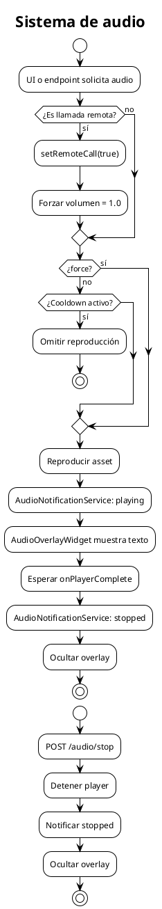

# Sistema de audio

Describe el flujo de reproducción de audio, incluyendo cooldown, llamadas remotas y overlay visual.

## Mermaid

```mermaid
flowchart TD
    Start[UI o endpoint solicita audio] --> Remote{¿Es llamada remota?}
    Remote -- Sí --> SetRemote[setRemoteCall(true)]
    SetRemote --> Vol[Forzar volumen = 1.0]
    Remote -- No --> Force{¿force?}
    Force -- Sí --> Play
    Force -- No --> Cooldown{¿Cooldown activo?}
    Cooldown -- Sí --> Omit[Omitir reproducción]
    Cooldown -- No --> Play[Reproducir asset]

    Play --> NotifyStart[AudioNotificationService: playing]
    Play --> Wait[Esperar onPlayerComplete]
    Wait --> NotifyStop[AudioNotificationService: stopped]
    NotifyStart --> Overlay[AudioOverlayWidget muestra texto]
    NotifyStop --> Hide[Ocultar overlay]

    Stop[/audio/stop] --> StopAudio[Detener player]
    StopAudio --> NotifyStop2[Notificar stopped]
```

## PlantUML



## Detalles de implementación

- Cooldown global de cinco segundos desde el inicio de la última reproducción aceptada.
- `AudioService.setRemoteCall(true)` marca la siguiente reproducción como remota.
- Las llamadas remotas fuerzan volumen al 100 %.
- El overlay es puramente visual y no controla el audio.
- Si no se proporciona `displayText`, se deriva del nombre del asset.

## Cuándo actualizar

- Cuando cambie la duración del cooldown.
- Cuando se modifique el comportamiento de llamadas remotas.
- Cuando cambie la lógica de overlay.
