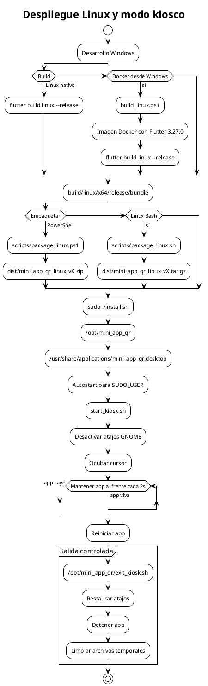

# Despliegue Linux y modo kiosco

Describe el flujo de build, empaquetado, instalación y operación en modo kiosco en Linux.

## Mermaid

```mermaid
flowchart TD
    Dev[Desarrollo Windows] --> Build{Build}
    Build -- Linux nativo --> Native[flutter build linux --release]
    Build -- Docker desde Windows --> Docker[build_linux.ps1]
    Docker --> Image[Imagen Docker con Flutter 3.27.0]
    Image --> Native

    Native --> Bundle[build/linux/x64/release/bundle]
    Bundle --> Package{Empaquetar}
    Package -- PowerShell --> PkgPs[scripts/package_linux.ps1]
    Package -- Linux Bash --> PkgSh[scripts/package_linux.sh]
    PkgPs --> Zip[dist/mini_app_qr_linux_vX.zip]
    PkgSh --> TarGz[dist/mini_app_qr_linux_vX.tar.gz]

    Zip --> Install[sudo ./install.sh]
    TarGz --> Install
    Install --> Opt[/opt/mini_app_qr]
    Install --> Desktop[/usr/share/applications/mini_app_qr.desktop]
    Install --> Autostart[Autostart para SUDO_USER]
    Install --> Kiosk[start_kiosk.sh]

    Kiosk --> Disable[Desactivar atajos GNOME]
    Disable --> Unclutter[Ocultar cursor]
    Unclutter --> Loop[Mantener app al frente cada 2s]
    Loop --> Crash[Reiniciar si la app cae]

    Exit[/opt/mini_app_qr/exit_kiosk.sh] --> Restore[Restaurar atajos]
    Restore --> StopApp[Detener app]
    Restore --> Clean[Limpiar archivos temporales]
```

## PlantUML



## Notas importantes

- El bundle debe distribuirse completo, no solo el ejecutable.
- El `.env` debe incluirse en el bundle con la configuración del entorno objetivo.
- `start_kiosk.sh` reinicia la app si deja de ejecutarse.
- No se recomienda matar directamente el script porque puede dejar atajos modificados.
- El icono configurado en el `.desktop` apunta a `data/flutter_assets/assets/icon.png`, que puede no existir.

## Cuándo actualizar

- Cuando cambie el proceso de build o empaquetado.
- Cuando se unifiquen los scripts de PowerShell y Bash.
- Cuando cambie la ruta de instalación o el modo kiosco.
