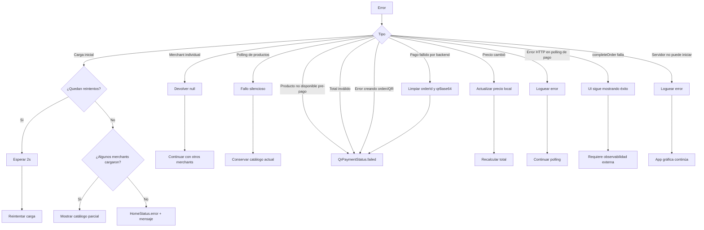
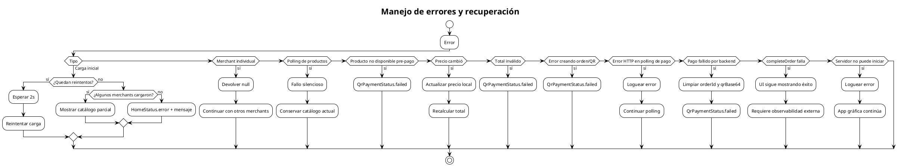

# Manejo de errores y recuperación

Describe las rutas de error principales del sistema y cómo la aplicación recupera o degradea gracefulmente.

## Mermaid

## PlantUML

## Cuándo actualizar

- Cuando se agregue un servicio centralizado de logs o métricas.
- Cuando cambie la política de reintentos.
- Cuando se modifique el comportamiento ante `completeOrder` fallido.
