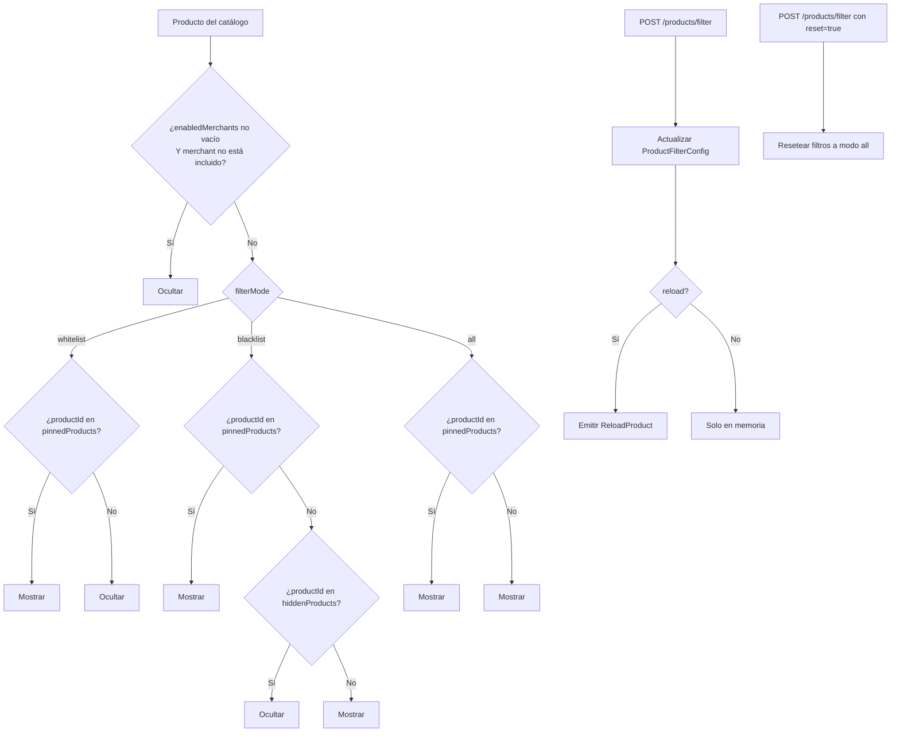
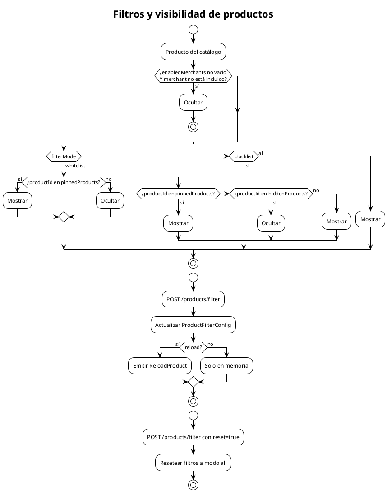

# Filtros y visibilidad de productos

Describe el orden de evaluación de `ProductFilterConfig` para decidir qué productos aparecen en el carrusel.

## Mermaid

## PlantUML

## Reglas de prioridad

1. Si `enabledMerchants` no está vacío y el merchant no está incluido, el producto se oculta.
2. En modo `whitelist`, solo se muestran productos en `pinnedProducts`.
3. Fuera de `whitelist`, un producto fijado se muestra incluso si está en `hiddenProducts`.
4. En modo `blacklist`, se ocultan los IDs en `hiddenProducts`.
5. En modo `all`, se muestra todo lo que haya superado la validación del merchant.

## Cuándo actualizar

- Cuando cambie el orden de evaluación.
- Cuando se agreguen nuevos modos de filtro.
- Cuando cambie la forma en que se aplican desde el endpoint.
